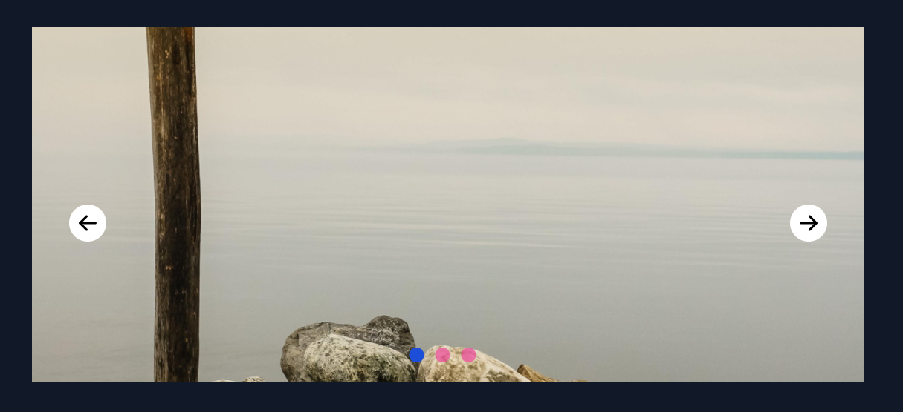

# First task with TailwindCSS

## Welcome! 👋

Thanks for checking out this front-end coding challenge.

## Information

[This project is my own project.]

I tried to practice and consolidate knowledge in it.
The effect you see for yourself 💪

> In this project I tried to do:

- learning and implementing knowledge from tailwindCSS and JavaScript

## About me! 🤓

Every day I improve my skills to be able to start working as FrontEnd Developer.
